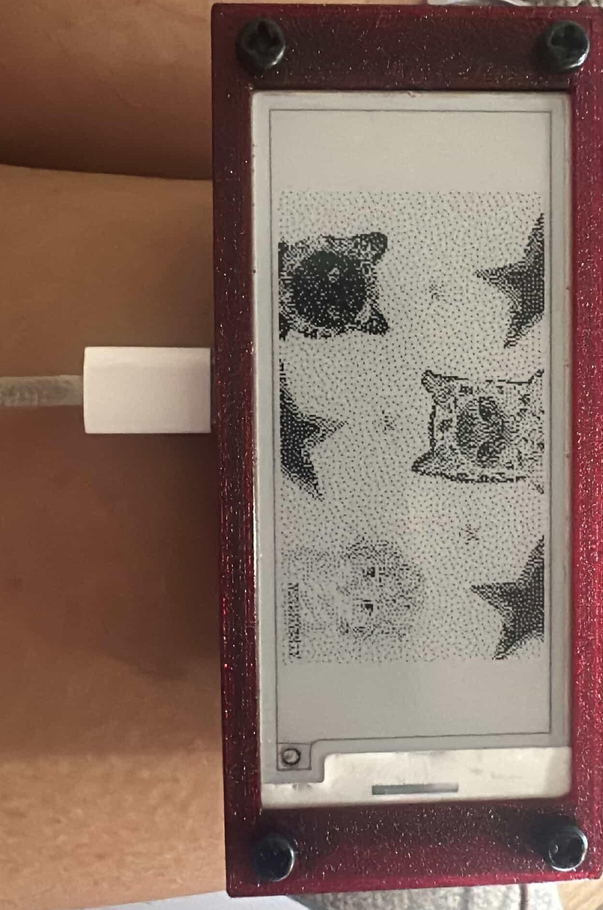

# E-paperKeychain
Simple e-paper display linked to a esp32-s3-zero with a 3d printed encasement

The goal of this project was to learn how to program and create projects with hardware. 

## 2. Overview/Introduction
This project was a fun idea I felt like would be an amazing gift or functional keychain that can be used in so many ways. I was in love with the ESLs at my local woolies, and got inspired to explore that technology as a result. Inherently this solution doesn't solve a problem, rather it tries to capture the benefits of e-paper displays and allow users to be either stylish(in black, white and red), show useful QRcodes or as a learning project from a hardware and software perspective. 

## 3. Features
Key Features
- Web Server running off Esp32-s3-Zero
- Retained display without power
- Wifi Access point

## 4. Demo/Visual


<video controls src="Content/VID_20251212_205514_026.mp4" title=""></video>
<video controls src="Content/VID_20251215_173922_935.mp4" title=""></video>
<video controls src="Content/VID_20251225_041710_654.mp4" title=""></video>
<video controls src="Content/VID_20251225_041716_174.mp4" title=""></video>

## 5. Hardware Requirements
**Components:**
- Microcontroller: Esp32-s3-Zero 
- Display - 2.9" E-paper module (black, White and Red)
- Power: Usb-C cable to anything
- Other: Pin headers

**Tools needed:**
- Soldering iron
- PC with Arduino IDE

## 6. Software Requirements
- IDE: ArduinoIDE
- Libraries: <GxEPD2_3C.h>, <Fonts/FreeMonoBold12pt7b.h>, <WiFi.h>, <ESPAsyncWebServer.h>, <AsyncTCP.h>

## 7. Installation/Setup

**Hardware Setup:**
```
1. Connect DHT22 to pin PA1
2. Connect ESP8266: TX->PA9, RX->PA10
3. Connect power supply to VIN and GND
[Include wiring diagram or link to /docs/wiring.md]