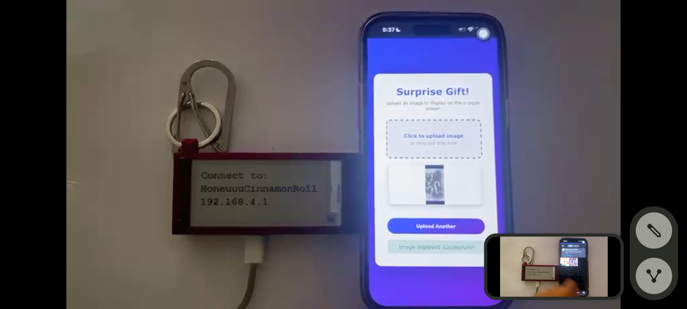

# E-paperKeychain
Simple e-paper display linked to a esp32-s3-zero with a 3d printed encasement

The goal of this project was to learn how to program and create projects with hardware. 

## 1. Overview/Introduction
This project was a fun idea I felt like would be an amazing gift or functional keychain that can be used in so many ways. I was in love with the ESLs at my local woolies, and got inspired to explore that technology as a result. Inherently this solution doesn't solve a problem, rather it tries to capture the benefits of e-paper displays and allow users to be either stylish(in black, white and red), show useful QRcodes or as a learning project from a hardware and software perspective. 

## 2. Features
Key Features
- Web Server running off Esp32-s3-Zero
- Retained display without power
- Wifi Access point

## 3. Demo/Visual



Below Videos are to show Progress and other styles I have experimented with. To download them click the embedded links below, then click the raw install to view a copy. Another way to view them is to visit my Portfolio. https://sirballoon.github.io/DevBook/ 


[Case Iteration 1](Content/VID_20251212_205514_026.mp4)
[Case Iteration 2](Content/VID_20251215_173922_935.mp4)
[Different Material](Content/VID_20251225_041710_654.mp4)
[No Lid Version](Content/VID_20251225_041716_174.mp4)

## 4. Hardware Requirements
**Components:**
- Microcontroller: Esp32-s3-Zero 
- Display - 2.9" E-paper module (black, White and Red)
- Power: Usb-C cable to anything
- Other: Pin headers

**Tools needed:**
- Soldering iron
- PC with Arduino IDE

## 5. Software Requirements
- IDE: ArduinoIDE
- Libraries: <GxEPD2_3C.h>, <Fonts/FreeMonoBold12pt7b.h>, <WiFi.h>, <ESPAsyncWebServer.h>, <AsyncTCP.h>

## 6. Installation/Setup

**Setup:**
```
1. Grab the e-paper module and the esp32-s3-Zero
2. Specifically connecting the Busy, Res, D/C, CS, SCL, SDA, GND and VCC to the correct ports as shown in Markdown File.
3. Connect the esp32 to ur PC through a type-c cable allowing you to interface with the device
4. Install the Code in the E-PaperServer.ino file
5. Once compiled onto the esp32, everything should work. 
6. 3d Print the enclosure. 

[Include wiring diagram or link to /docs/wiring.md]